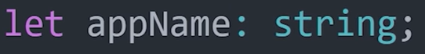
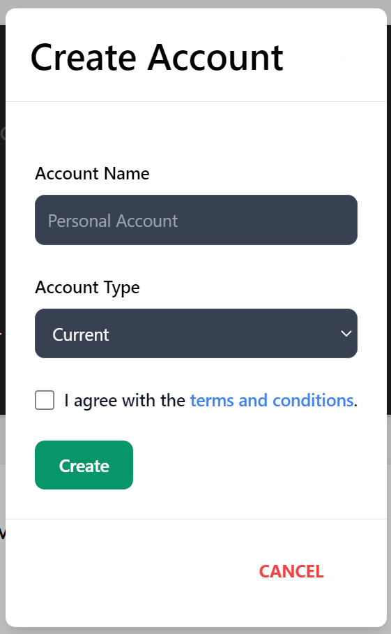

# Guide for Learners: Typescript

This guide demonstrates how to learn Typescript and how to use it to create a functional front-end website. An excellent way to learn this skill, is to apply it to a practise project and to research documentation associated with specific project tasks.

## Background

In order to benefit the most from this guide, knowledge of Javascript is essential, as the content provided assumes readers are at least familiar with programming in Javascript, although not yet at intermediate level.

This guide does, however, provide links to brush up on forgotten Javascript programming. 

Furthermore, knowledge on how to use NodeJS and any (Front-end) Framework would be useful. In this guide, React will be used as the Framework. 

---

## Javascript 

Here are some useful links on learning Javascript:

1. [Basic Javascript](https://www.w3schools.com/js/DEFAULT.asp)
2. [Javascript for front-end development](https://www.w3schools.com/howto/howto_blog_become_frontenddev.asp)
3. [Creating a server](https://expressjs.com/)
4. [Basic Javascript for back-end development ](https://www.geeksforgeeks.org/javascript-backend-basics/) (contains further links to more advanced tutorials)

---

## Why learn Typescript? 

There are many advantages to learning Typescript:

1. **Code Legibility**
2. **Code Maintainability**
3. **Faster Error Handling**

### Code Legibility

In Javascript it can become difficult to decifer code, especially when working on a project with others. Because Javascript is particularly good at interpretting code, it is very lenient with users in terms of the code it will accept to be run. For example Javascript will:

- interpret a miss-spelt word correctly
- assume the existance of a forgotten semicolon at the end of a line
- assign a tpye to a varibable  

This leniency can unfortunately make it hard for programmers to understand the code, as so much is internally intepreted by Javascript. 

Typescript on the other hand is much stricter, expecting the user to assign types to variables, add semicolons at the end of lines and to correctly spell strings. This enables code to be more easily understood as it is immediately visible to the programmer, rather than being internally intepreted. Furthermore, it is advantageous for programmers to learn proper coding practises, such as ending lines with semicolons, as this is vital for maintaining code.

### Code Maintainability

Maintaining code and adhearing to good programming practises can be a difficult task, made much simpler through the use of Typescript. Typescript adds types to each variable which improves legibility, as knowing the type of each variable makes it easier to understand the context of the input and ouput types and how the function will be used. Furthermore, it forces the good programming practise of creating legible code, thus maintinging a good coding structure.

### Faster Error Handling

As Typescript is stricter than Javascript, syntax errors and various other non-user input errors will be spotted in the interface during build time by Typescript, rather than in the browsers developer console when using Javascript.

---

## Learning Typescript

### Overview

[Here](https://www.youtube.com/watch?v=zQnBQ4tB3ZA) is a short overview video on Typescript and the basics on how to use it.

To summarise the most important concepts from the video:

Typescript extends Javascript with static typing, forcing each variable to have a type. The language is stricter and includes static type checking, which checks for syntax and type errors during build time rather than run time. Once you have written code in Typescript it is compiled to Javascript and run.

"Typescript behaves like a compiled language, where Javascript is the compilation target."

Here is an example of how to add a type in Typescript:

*Separate the variable with a **colon** and then add a **type**.*

### Practise Project

Creating a Pratice Project is a good way to:

1. Learn how to set up Typescript with a new project
2. Get a feel for how developing a project with Typescript works
3. Learn more about building and running a website using Typescript

[Here](https://www.youtube.com/watch?v=kSukGsJ0s9A) is a link to a YouTube tutorial on setting up a project using Typescript. The video, although useful, is fast paced, so here is summary of the project setup segment from the video in easy to follow steps: 

Hover the mouse over the images for more information.

. Then create a new string and call the above function, with the new string as the parameter")

### React

Although React is not utilised heavily in this tutorial, it is a vital component of the entire project structure's framework. As such, here are useful links for learning React:

- [Overview]https://www.youtube.com/watch?v=Tn6-PIqc4UM

- [Documentation] https://reactjs.org/docs/getting-started.html

### Front-End Functionality

Typescript can be used to create functional front-end components such as a sidebar and buttons in the same way as Javascript, although the Typescript syntax differs slightly.

#### **Sidebar**

To create a Sidebar using React, TailwindCSS and Typescript, follow [this video tutorial](https://youtu.be/pfaSUYaSgRo). Remember this tutorial was created in base Javascript and so must be modified into Typescript. The main difference will be the syntax.

This is the code segement used in the [Mock Banking Website](https://github.com/LMC-Enjoyers/Mock-Banking-Website). React is not an essential part of the sidebar, however it is used for the icons such as "BiLogOut": 

The Sidebar function contains the functional components SidebarItem and SidebarEnd, which are defined below.

Note the Typescript syntax of the SidebarItem, which includes prameters "icon" of type *any*, "item" of type *string* and "content" of type *string*, is one of the main differences to Javascript. In addition, in contrast to Javascript, the HTML elements are wrapped inside a function, made possible by React.

#### **Modals**

Modals are pop-out boxes that contain various content, such as an input field. The front- and back-end connection for the input is the same as an HTML/Javascript project. 

**Note**: React does not alter the process of sending data to the back-end to be processed and stored. 

Code segment for this modal can be found [here](https://github.com/LMC-Enjoyers/Mock-Banking-Website/blob/main/src/components/sidebar/modals/Modals.tsx).

The example above demonstrates the creation of a new account. As the first image shows the input fields are an account name requiring a string input, an account type requiring a specific string from the drop down menu and finally the terms of service box which requires a boolean value to be true in order to create a new account.

The function CreateAccount contains the functional component handelSubmit, which awaits the inputs for each field, then stores the data in as a string and sends it to the endpointRout, more specifically the new_acc function, which is located on the back-end of the webpage. This process is the same as a regular HTML/Javascript website. The main difference is that each input, before being sent to the backend is required to have a type.

[Modals](https://mui.com/material-ui/react-modal/) themselves are simple to create, as they are simply a button that makes an input field appear and disappear when the button is clicked. This occurs through the use of **onClick**, as shown in the second and third images.

The fourth image demonstrates how to create the dropdown menu used in the Account Types input. Once the user chooses one of the inputs from the list, the onChange function changes the output to the selcted input, thus setting the setAccountType variable to be the selected input, by using the useState method imported from the React library.

---

## Recommendation on using Typescript

Typescript is a very useful tool, which I would recommend for large, group projects, where an overview of code is vital and bugs must be fixed immediately. It works best with projects that will continuously be developed and altered.

However, I would not advise using Typescript for small, group projects such as for the [Mock Banking Website](https://github.com/LMC-Enjoyers/Mock-Banking-Website), as more moderat projects contain less bugs and require less code to be written. For this reason, the extra time required to code in Typescript does not justify its use in this type of project.

