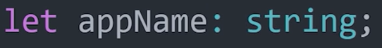
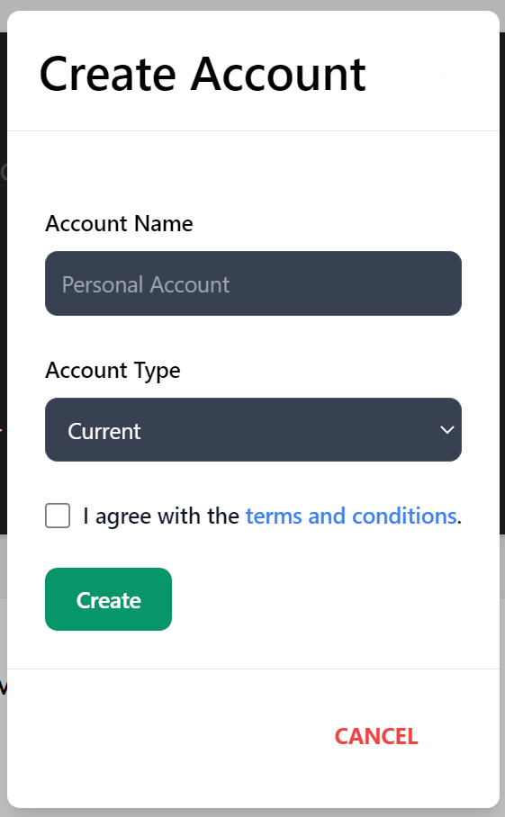

# Guide for Learners: Typescript

This guide will demonstrate how to learn Typescript and how to use it to create a functional front-end website.

## Background

In order to benefit the most from this guide, knowledge of how to program in Javascript is essential, as the content provided will assume that readers are at least familiar with Javascript, but not at intermediate levels yet.

However, this guide will provide links to be used to brush up on forgotten Javascript programming. 

Furthermore, knowledge on how to use NodeJS and any (Front-end) Framework will be useful. In this guide, React will be used as the Framework. 

---

## Javascript 

Here are some useful links on learning Javascript:

1. [Basic Javascript](https://www.w3schools.com/js/DEFAULT.asp)
2. [Javascript for front-end development](https://www.w3schools.com/howto/howto_blog_become_frontenddev.asp)
3. [Creating a server](https://expressjs.com/)
4. [Basic Javascript for back-end development ](https://www.geeksforgeeks.org/javascript-backend-basics/) (contians further links to more advanced tutorials)

---

## Why learn Typescript? 

There are many advantages to learning Typescript:

1. **Code Legibility**
2. **Code Maintainability**
3. **Faster Error Handling**

### Code Legibility

In Javascript it can become difficult to decifer code, especially when working on a project with others. This is due to Javascript being vary lenient with the user in terms of what code is acceptable to be run, as Javascript is very good at intepreting code:

- Miss spelt a string, Javascript will intepret it correctly
- Forgot a semicolon at the end of a line, Javascript will assume it exists
- Didn't assign a type to a variable, Javascript will assign one for you

The problem is, due to this leniency, it can be hard for programmers to understand the code, due to so much being internally intepreted by Javascript. 

Typescript on the other hand is much more strict, expecting the user to assign types to variables, add semicolons at the end of lines and to correctly spell strings. This causes code to be much easier to understand at it is all presented in front of the programmer, rather than being internally intepreted. Furthermore, it is more advantageous for programmers to learn these proper coding practises, such as ending lines with semicolons, as it is vital for maintaining code.

### Code Maintainability

Maintaining code and adhearing to good programming practises can be a difficult task, made much simpler through the use of Typescript. Typescript adds types to each variable which improves legibility, as knowing the type of each variable makes it easier to understand the context of the input and ouput types and how the function will be used. Furthermore it forces the good programming practise of creating legible code, thus maintinging a good coding structure.

### Faster Error Handling

As Typescript is much more strict than Javascript, syntax errors and various other non user input errors will be spotted in the interface during build time by Typescript, rather than in the browsers developer console when using Javascript.

---

## Learning Typescript

### Overview

[Here](https://www.youtube.com/watch?v=zQnBQ4tB3ZA) is a short overview video on what Typescript is and the basics of how to use Typescript.

To summarize the most important concept from the video:

Typescript extends Javascript with static typing, forcing each variable to have a type. The language is also much more strict and includes static type checking, which checks for syntax and type errors during build time rather than run time. Once you have written code in Typescript it then gets compiled to Javascript and run.

"Typescript behaves like a compiled language, where Javascript is the compilation target."

Here is an example of how to add a type in Typescript:

*Separate the variable with a **colon** and then add a **type**.*

### Practise Project

Creating a Pratice Project is a good way to learn:

1. How to set up Typescript with a new project
2. Get a feel for how developing a project with Typescript works
3. Learn more about building and running a website using Typescript

[Here](https://www.youtube.com/watch?v=kSukGsJ0s9A) is a link to a YouTube tutorial on how to set up a project using Typescript. The video, although useful, is very fast paced, so here is summory of the video in easy to follow steps: 

Hover over the images for more information

. Then create a new string and call the function created, inputing the new string created ")

### React

Although React is not used much in this tutorial, it is a vital component of the entire project structures framework. As such, here are a couple links that are useful for learning React:

- [Overview]https://www.youtube.com/watch?v=Tn6-PIqc4UM

- [Documentation] https://reactjs.org/docs/getting-started.html

### Front-End Functionality

To use Typescript to create functional front end components such as a sidebar or buttons is no different than Javascript, except the syntax is slightly different and more strict.

#### **Sidebar**

To create a Sidebar using React, TailwindCSS and Typescript, follow [this video tutorial](https://youtu.be/pfaSUYaSgRo), whilst remembering that this tutorial was created in base Javascript and thus must be modified into Typescript. The main difference will be the syntax.

This is the code segement used in the [Mock Banking Website](https://github.com/LMC-Enjoyers/Mock-Banking-Website). React is not an essential part of the sidebar, however it is used for the icons such as "BiLogOut", which is this icon: 

The Sidebar function contains the functional components SidebarItem and SidebarEnd, which are defined bellow it.

Note the syntax of the SidebarItem, which includes prameters icon of type *any*, item of type *string* and content of type *string*, which is one of the main differences to Javascript.

#### **Modals**

Modals are pop-out boxes that require an input form the website user. The front- and back-end connection is the same as a html/javascript project. React does not alter the process of sending the data to the back-end to be processed and stored. 

Code segment for this modal can be found [here](https://github.com/LMC-Enjoyers/Mock-Banking-Website/blob/main/src/components/sidebar/modals/Modals.tsx).

The example above demonstrates the creation of a new account. As shown in the first image, the input fields are an account name which requires a string input, an account type which requires a specific string from the drop down menu and finaly the terms of service box which requires a boolean value to be true in order to create a new account.

The function CreateAccount contains the functional component handelSubmit, which awaits for the inputs for each field, then stores the data in as a string and sends it to the endpointRout, more specifically the new_acc function, which is located on the back-end of the webpage. This process, as stated in the React segment, is the same as a regular HTML/Javascript website. The main difference is that each input, before being sent to the backend is required to have a type.

[Modals](https://mui.com/material-ui/react-modal/) themselves are very simple to create, as they are simply speeking a button that makes an input field appear and disapear when clicking a button. This occurs through the use of **onClick**, as shown in the second and third image.

The fourth image demonstrates how to create the dropdown menu used in the Account Types input. Once the user chooses one of the inputs from the list, the onChange function changes the output to the selcted input, thus setting the setAccountType variable to be the selected input by using the useState method imported from the React library.

## Recommendation on using Typescript

Typescript is a very useful tool, especial for large, group projects, where an overview of code is vital and bug fixed as soon as possible. For these reasons I would recommend learning Typescript.

However, I would not recommend using Typescript for small, group projects such as for the [Mock Banking Website](https://github.com/LMC-Enjoyers/Mock-Banking-Website), as the benefits Typescript provides for small project in comparison to the time spent implementing it is not worth it, especially when considering that the project will no longer be worked on.

Typescript works best with projects that will continuously be developed and altered.

